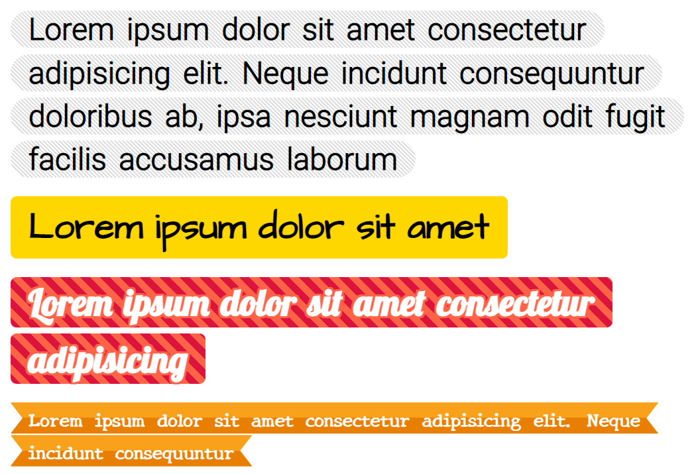

# Experiment with multiline background
Mini script for transform text to multiline-text with separate rows and background.

demo: https://kartofelek007.github.io/multiline-text/

### Usage
1. Add `multiline-text.js` and `multiline-text.css` to your page.
2. Create instance of lineText and add element to change:
```js
const mySuperHeader = document.querySelector("h2.title");

const lines = new MultilineText;
lines.addElement(mySuperHeader);
```


3. Add style for this element. If you want add padding to left and right sides, use `--padding-l` and `--padding-r` variables:

```css
/* element before change */
.title {
    font-size: 20px;
    font-weight: bold;
    padding-top: 15px;
    padding-bottom: 15px;

    padding-left: 13px;
    padding-right: 13px;
}

/* element after change to multi line element */
/* if you want change padding-left and padding-right, you must use this variables */
.title[data-text-lines] {
    --padding-l: 13px; /* default is 1rem */
    --padding-r: 13px; /* default is 1rem */
}

/* single row */
.title[data-text-lines] .line-text__row {}

/* single word */
.title[data-text-lines] .line-text__word {}
```

If you want change padding for single row you should use `--padding-l` and `--padding-r` variables:

```css
.title[data-text-lines] {
    --padding-l : 15px;
    --padding-r : 15px;
}
.title[data-text-lines] .line-text__row {
    margin-bottom: 5px;
    color: #fff;
    background: gold;
    padding-top: 7px;
    padding-bottom: 7px;

    /*
    or user variables:
    var(--padding-l) - left padding
    var(--padding-r) - right padding
    */
    padding: 7px var(--padding-r);
    /* or */
    padding: 7px var(--padding-r) 7px var(--padding-l);
}
```

In `multiline-test.css` you may see why this step is needed.

Look at [demo.css](./demo.css) for more examples.